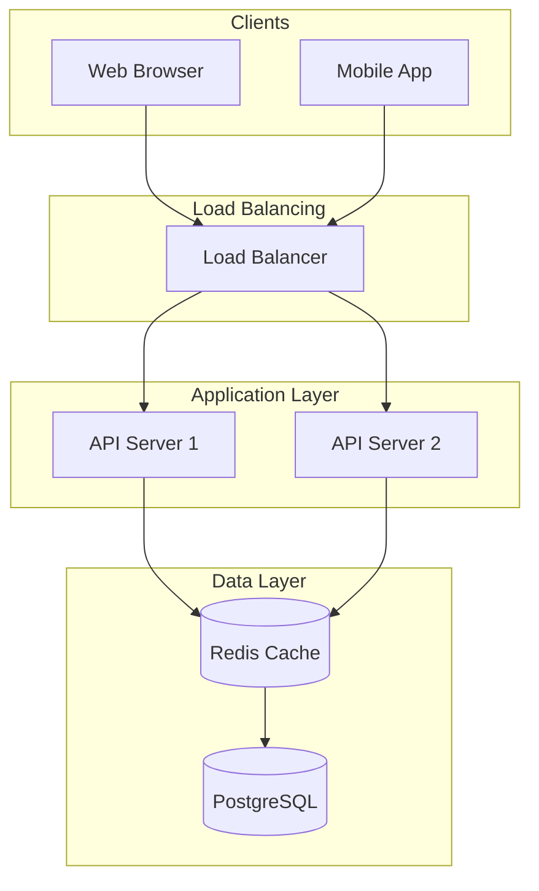

# US-04: Mermaid Diagram Generation

## Story

**As an** interviewer,
**I want** the AI candidate to generate architecture diagrams using Mermaid,
**So that** I can see visual representations of the proposed system design.

## Acceptance Criteria

1. **Diagram Rendering**
   - Right panel displays rendered Mermaid diagram
   - Diagram renders in real-time as candidate provides it
   - Clean, readable diagram styling
   - Diagram panel has appropriate sizing and scrolling

2. **Diagram Types Supported**
   - Flowcharts (primary) - for system architecture
   - Sequence diagrams - for request flows
   - C4 diagrams - for component relationships (if supported)

3. **Diagram Content**
   - Shows major system components (clients, servers, databases, caches)
   - Shows data flow between components
   - Labels are clear and concise
   - Appropriate level of detail (not too granular)

4. **User Interaction**
   - Diagram displays without user action when candidate provides one
   - Placeholder shown when no diagram exists yet
   - Error message if diagram fails to render

## Technical Notes

- Use Mermaid.js library for rendering
- Parse diagram code from Claude response (look for mermaid code blocks)
- Store current diagram in LiveView assigns
- Consider pan/zoom for complex diagrams

## Example Diagram Output

## Dependencies

- US-01: Basic chat interface

## Estimation

- **Complexity**: Medium
- **Priority**: P0 (Critical Path)
