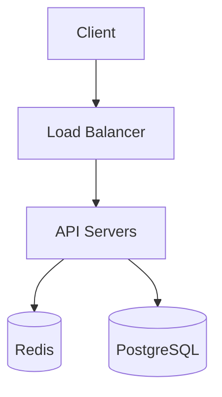

# US-13: Session Export to Markdown (Stretch)

## Story

**As an** interviewer,
**I want** to export the interview session as a markdown file,
**So that** I can review the conversation later and share it with others.

## Acceptance Criteria

1. **Export Button**
   - Clearly visible "Export" button in UI
   - Available at any point during session
   - Keyboard shortcut (Ctrl+E or Cmd+E)

2. **Export Content**
   - Full conversation transcript
   - All diagrams (as Mermaid code blocks)
   - Technology preferences used
   - Timestamp of session
   - Requirements checklist status (if available)

3. **Export Format**
   - Clean markdown formatting
   - Messages labeled with role (Interviewer/Candidate)
   - Diagrams in fenced code blocks
   - Metadata in YAML frontmatter

4. **Download Experience**
   - Automatic file download
   - Sensible filename (e.g., `system-design-url-shortener-2024-01-15.md`)
   - Copy to clipboard option
   - Preview before download (optional)

## Technical Notes

- Generate markdown server-side in Elixir
- Use `send_download` for file delivery
- Consider browser's Clipboard API for copy feature
- Store conversation history in assigns for export

## Export Format Example

```markdown
---
title: System Design Interview - URL Shortener
date: 2024-01-15T14:30:00Z
duration: 45 minutes
technologies: [PostgreSQL, Redis, AWS]
---

# System Design Interview: URL Shortener

## Conversation

### Interviewer (14:30)
Design a URL shortener like bit.ly

### Candidate (14:31)
Great question! Before I dive in, I'd like to understand a few things:

1. What's the expected scale?
2. Do we need analytics?
...

## Final Architecture



## Requirements Covered

- [x] Core use case defined
- [x] Traffic estimates
- [x] High-level architecture
- [ ] Deep dive: Database sharding
```

## Dependencies

- US-01: Basic chat interface
- US-04: Mermaid diagram generation

## Estimation

- **Complexity**: Low-Medium
- **Priority**: P3 (Stretch Goal)
